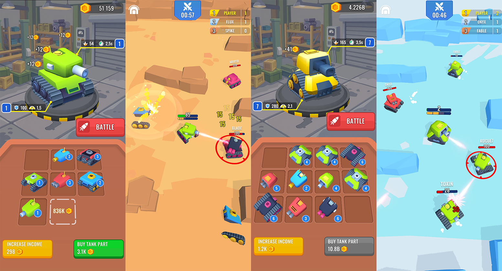

# Tanks Merge: Arena Battles

Мобильная игра, в которой игрок собирает боевой танк на merge доске и сражается на нем с ботами на арене.

https://github.com/user-attachments/assets/af223966-fc76-4e06-8397-6935d7d880eb

## Ссылки

### 🎮 [Скачать с App Store](https://apps.apple.com/us/app/id6761921730)

## Стек и зависимости

- `Unity 6000.0.59f2`
- `VContainer`
- `UniTask`
- `R3`
- `MessagePipe`
- `DOTween`
- `Cinemachine`
- `Addressables`
- `Unity NavMesh`
- `Unity Localization Package`
- `Unity Test Framework`

## Архитектура

- Зависимости собираются через VContainer:
  - `ProjectLTS` - корневой скоуп (Singleton). Регистрирует все глобальные сервисы. 
  - `HomeLTS` / `BattleLTS` / `TutorialBattleLTS` - дочерние скоупы (Scoped),
    поднимаются при загрузке соответствующей сцены и регистрируют
    сервисы, вью и точки входа своего контекста.
- `Bootstrap` обрабатывает инициализацию игры.
- `AppStateMachine` управляет состояниями игры: `HomeState`, `BattleState`, `TutorialBattleState`. Каждое состояние загружает свои сцены и управляет эффектом перехода.

## Экономика и конфиги

Балансная конфигурация хранится в `ScriptableObject`-конфигах.

- `EconomyConfigSO` - параметры баланса экономики
- `MergeConfigSO` - параметры merge-сессии
- `BattleConfigSO` - длительность боя, количество ботов, задержка респауна, радиус автоприцела, префабы танков
- `BotDifficultyConfigSO` - таблица тиров DDA: распределение ботов по весовым категориям и смещение их уровня снаряжения относительно игрока
- `BotBehaviorConfigSO` - профили поведения для ботов
- `TankPartStatsCatalogSO` -  боевые статы для частей данка
- `ArenaCatalogSO` - каталог арен

`EconomyService` - единственная точка с формулами баланса, покрыта unit-тестами.

## Сохранения

Каждый data-сервис реализует `ISaveModule` и регистрируется параллельно со своим бизнес-интерфейсом. `SaveService` собирает все модули через DI, сериализует и сохраняет в одном файле.

`AutoSaveService` вызывает сохранение с заданным интервалом, а также при потере фокуса (`Application.focusChanged`) и при выходе (`Application.quitting`).

Модули, сохраняющие состояние: `CurrencyService`, `EquipmentDataService`, `MergeDataService`, `IdleDataService`, `OfflineIncomeDataService`, `TutorialDataService`, `BattleStatsDataService`, `AudioService`.

## Battle Flow

Логикой боя в режиме FFA (free-for-all) управлеяет  `FfaBattleFlow`, который реализует интерфейс `IBattleFlow`.

`FfaBattleFlow` последовательно запускает фазы боя:

`Init ⮕ Countdown ⮕ Active ⮕ End ⮕ Result`

Новый режим боя (например, Team, Boss, Survival) = новая реализация `IBattleFlow`.

## AI ботов

`BotBrain` - это `MonoBehaviour` компонент, который отвечает за поведение танка бота.

Внутри `BotBrain` - стейт-машина на четырёх состояниях:

- `Patrol` - бот перемещается по арене в поисках цели
- `Chase` - обнаружил противника, преследует его
- `Attack` - в зоне атаки, открывает огонь
- `Retreat` - HP упало ниже порога, уходит на безопасную дистанцию

Всё поведение: радиус патруля, дистанция атаки, время реакции, порог отступления - настраивается через `BotBehaviorConfigSO` без правки кода. 

Поскольку `BotBrain` - просто компонент на префабе танка, для босса или особого врага достаточно заменить компонент BotBrain на другую реализацию `ITankInput`.

## Dynamic Difficulty Adjustment

Сложность ботов адаптируется по двум осям:

- **Количество боёв** на текущем снаряжении повышает тир.
- **Количество неудачных финишей** снижает тир на одну ступень каждые N провалов; любой успешный финиш обнуляет счётчик.

Оба счётчика сбрасываются при экипировке детали нового максимального уровня. Логика изолирована в `BattleDifficultyService` и покрыта unit-тестами.

## Туториал

Обучение разбито на два независимых этапа:

- **Home tutorial** (`HomeTutorialController`) - знакомит с merge и idle механиками.
- **Battle tutorial** (`TutorialBattleController`) - сценарий для обучения бою.

Используется однонаправленная зависимость: туториал использует код игры, но игровой код ничего о туториале не знает. Прогресс сохраняется после каждого шага - рестарт посреди обучения продолжит с последней завершённой точки.

## Реклама

За общим интерфейсом `IRawAdsProvider` скрыты два провайдера: `AdMobRawAdsProvider` и `MockRawAdsProvider`. Переключение через `AdsConfigSO.ProviderMode` в инспекторе - без перекомпиляции, можно работать в редакторе без реального SDK.

Поверх провайдера стоит `AdsService`, который ограничивает частоту интерстишиал-рекламы и отправляет рекламные события в аналитику.

## Аналитика

`IAnalyticsService` реализована через `AppMetricaAnalyticsService` в продакшене и `MockAnalyticsService` в dev-билдах. Плейсменты и названия событий - константы в `AnalyticsEvents`.

## Тесты

EditMode unit-тесты (Unity Test Framework) покрывают критичные изолированные системы: `EconomyService` (все формулы баланса), `BattleDifficultyService` (DDA логика), `MergeModel` / `MergeRuleService` (правила слияния), `CostFormatter` (форматирование валюты).

## Контакты

- **Email**: alex8rrr@gmail.com
- **Telegram**: @a_dev_99
